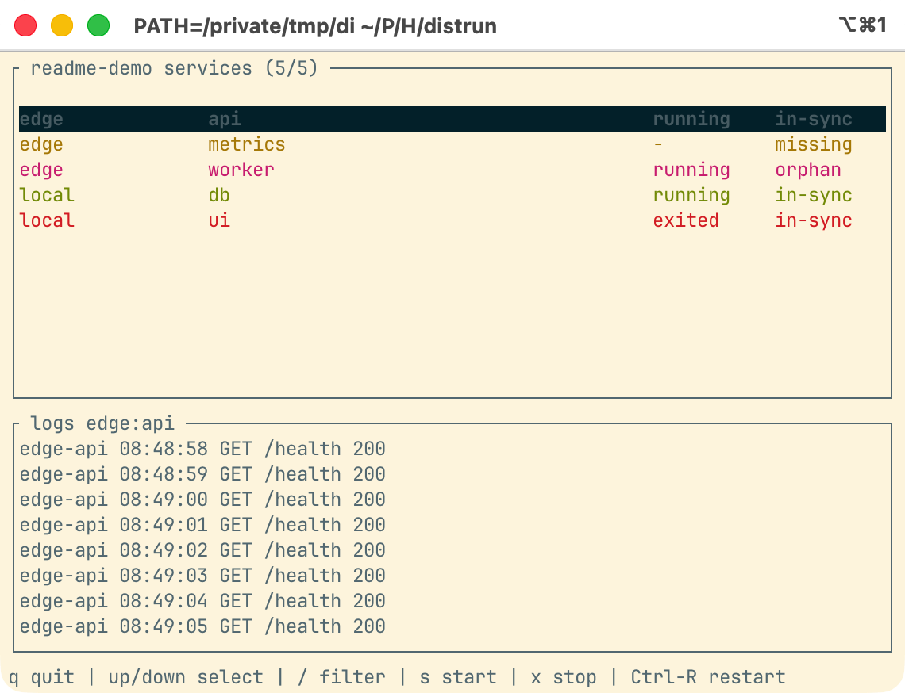

# distrun

Run a small process stack across your laptop and SSH hosts, then inspect status
and logs from one terminal. distrun uses `tmux` locally and over SSH, so there is
no remote daemon to install.



## Example

Put this in `distrun.yml`:

```yaml
project: readme-demo
on_existing: skip

hosts:
  edge:
    ssh: edge # any target from your OpenSSH config

services:
  api:
    host: edge
    cmd: bash -lc 'while true; do echo edge-api $(date +%H:%M:%S) GET /health 200; sleep 1; done'

  worker:
    host: edge
    cmd: bash -lc 'while true; do echo edge-worker job complete; sleep 2; done'

  db:
    cmd: bash -lc 'while true; do echo local-db ready; sleep 2; done'

  ui:
    cmd: bash -lc 'echo local-ui build failed; exit 2'
```

Then run:

```sh
distrun up
distrun tui
```

Omit `host` for local services. Set `host` to a named entry under `hosts` for a
remote service; the `ssh` value is passed to your system `ssh` command.

The screenshot above was captured after changing `worker` to `metrics` in the
config. That puts the important states in one view: a remote service still
running, a configured service that is missing, an old remote service now marked
as an orphan, and a local service that exited.

To reproduce the README screenshot with the Docker SSH fixture used by the
integration test:

```sh
scripts/capture-readme-tui.sh
```

## Commands

```sh
distrun up
distrun status
distrun status --all
distrun logs api --host edge
distrun tui
distrun restart
distrun down
```

`on_existing: skip` leaves running services alone and recreates only missing or
exited services. `on_existing: restart` stops and recreates configured services
when you run `distrun up`.

## Configuration

Use `include` to split config across files, and `include?` for optional local
overrides:

```yaml
include:
  - ./hosts.yml
  - ./services/api.yml
include?: ./distrun.local.yml
```

`env_file` values are read on the machine running distrun, then sent with the
service command. Later env files override earlier ones, and inline `env:`
overrides `env_file`.

String values support Docker Compose-style interpolation: `$KEY`, `${KEY}`,
`${KEY:-default}`, `${KEY:+replacement}`, `${KEY:?error}`, and related forms.
See [Interpolation](docs/interpolation.md) for the exact loading layers.

## Status

`status` reports runtime state (`running`, `exited`, `unknown`) and config state
(`in-sync`, `missing`, `orphan`).

```text
HOST             SERVICE                  RUNTIME    SPEC
edge             api                      running    in-sync
edge             metrics                  -          missing
edge             worker                   running    orphan
```

`status --all` inspects every `distrun_*` tmux session on the configured hosts.
Use repeated `--host` flags with `status --all` to inspect hosts without loading
a config file.

## TUI

`distrun tui` shows the service table, recent logs for the selected service, and
actions for common repairs.

Controls:

- `up`/`down` or `k`/`j`: select a service.
- `/`: filter by host, service, runtime, or spec state.
- `s` or `F7`: start the selected configured service.
- `x` or `F9`: stop the selected running service, including orphans.
- `Ctrl-R` or `F8`: restart the selected configured service.
- `q`: quit.

The log pane uses the same backend as `distrun logs`: tmux scrollback is the
source of truth, and distrun does not persist a separate log cache.

## Tests

The integration test starts a Debian OpenSSH + tmux container and runs the
compiled `distrun` binary against it:

```sh
scripts/run-docker-tests.sh
```

It covers remote start, logs, missing/orphan detection after config changes,
`on_existing: skip`, restart, and project shutdown.

## Current Limitations

distrun does not compare a running tmux pane with the current service command,
environment, or working directory. Use `on_existing: restart`, `distrun restart`,
or `distrun down && distrun up` when you want to recreate processes after config
changes.

If a whole host is removed from the config, distrun cannot discover leftover
processes on that host because it does not keep a local state database or remote
manifest.

## License

distrun is licensed under the Apache License, Version 2.0. See [LICENSE](LICENSE)
for details.
